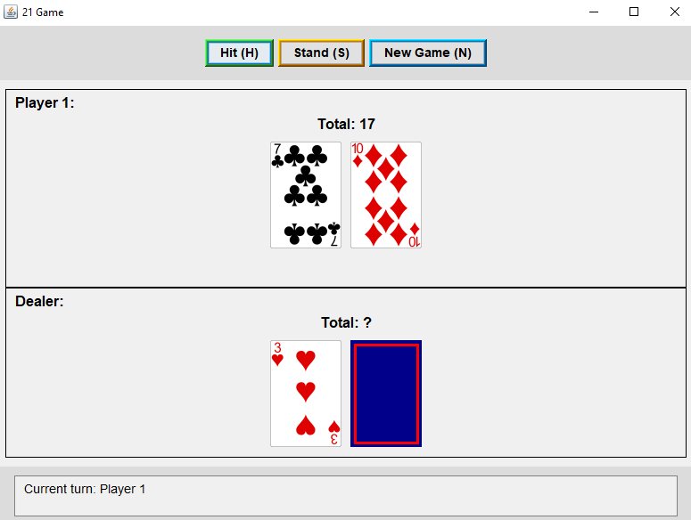

# Blackjack (21) Game

 

A Java implementation of the classic Blackjack (21) card game with a Swing-based GUI. This project features multiplayer support, dealer AI, and keyboard shortcuts for quick gameplay.

## Features

- 🃏 **Multiplayer Support**: Play with 1-4 players
- 🎮 **Keyboard Shortcuts**: Quick actions with H (Hit), S (Stand), N (New Game)
- 💻 **Swing GUI**: Clean, responsive interface
- 🤖 **Dealer AI**: Automated dealer follows standard casino rules
- 📊 **Game Stats**: Real-time hand totals and game status
- ♻️ **New Game**: Quick reset for continuous play

## How to Play

1. **Start the game** by running `Main.java`
2. **Enter player names** when prompted
3. **Gameplay**:
   - **Hit (H)**: Take another card
   - **Stand (S)**: Keep your current hand
   - Players automatically stand on 21 or bust
4. **Dealer plays** after all players finish
5. **Results** are shown comparing each player's hand to the dealer's

## Game Rules

- Standard Blackjack rules apply
- Dealer must hit on 16 or less, stand on 17 or more
- All cards are face up except dealer's second card (revealed at end)
- No splitting, doubling down, or insurance in this version

## Installation

1. **Requirements**:
   - Java JDK 11 or later
   - Maven (for building)

2. **Build and Run**:
   ```bash
   git clone https://github.com/Maxim44221/21-Game
   cd 21-game
   javac -d bin src/blackjack/*.java
   jar cvfm package/blackjack-game.jar scr/MANIFEST.MF -C bin . -C src/blackjack/cards .

   # run
   java -jar blackjack-game.jar


   